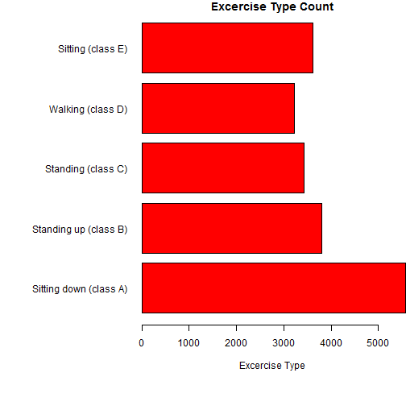

## Basic Information

 * Purpose
  * Get ready for Practical Machine Learning course
   * Understand the dataset
   * Explore it
   * Or review the lessons, if you already took that course
  * Explore real-life human activity recognition dataset
   * Find the sensed features that can distinguish one activity from another
 * Dataset
  * Human Activity Recognition Dataset collected by Pontifical Catholic University of Rio de Janeiro
(Rio de Janeiro, Brazil) - http://www.puc-rio.br/
  * Dataset reference: Velloso, E.; Bulling, A.; Gellersen, H.; Ugulino, W.; Fuks, H. Qualitative Activity Recognition of Weight Lifting Exercises. Proceedings of 4th International Conference in Cooperation with SIGCHI (Augmented Human '13) . Stuttgart, Germany: ACM SIGCHI, 2013.

--- .class #id 

## Dataset Details

 * Dataset available under Creative Commons license (CC-BY-SA)
 * Contains information about following excercises: Sitting down (class A), Standing up (class B), Standing (class C), Walking (class D), Sitting (class E)
 
 

--- .class #id 

## Dataset and Applicaiton

 * Sensor positions: arm, belt, forearm, dumbbelt
 * Sensor types: accelerometer, magnetometer, gyroscope
 * Dataset contains following potential information sources (sensor readings): Roll - belt, Pitch - belt, Yaw - belt, Absolute acceleration - belt, Gyroscope - belt - X-axis, Gyroscope - belt - Y-axis, Gyroscope - belt - Z-axis, Accelerometer - belt - X-axis, Accelerometer - belt - Y-axis, Accelerometer - belt - Z-axis, etc.
   * and many more...
 * Application already performed initial data cleaning
  * Before any data cleaning: 159 available information sources
  * Before analyzing sensor reliability: 152 available information sources
  * After full data cleaning: 52 available sensors
 * Application transformed names to friendly readable format
  * Both for sensor names and for activity names
  * Transformation is automated

--- .class #id 

## Using The Application
  
  * Select the activities of interest using the checkboxes
    * The activities selected on the left will be depicted in red
    * The activities selected on the right will be depicted in blue
  * Select the sensor reading in the drop-down menu
    * Sensor readings that have too many N/As are already removed from the list
    * Unrelated information sources (like number of the sliding window) are also removed from the list
  * Analyze the histogram
    * Select at least one activity for histogram to appear
    * Turn on mean or median lines if required
  * Analyze summary statistics at the bottom

